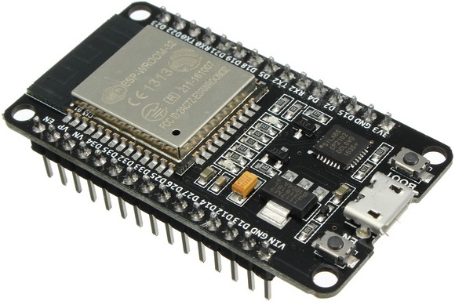
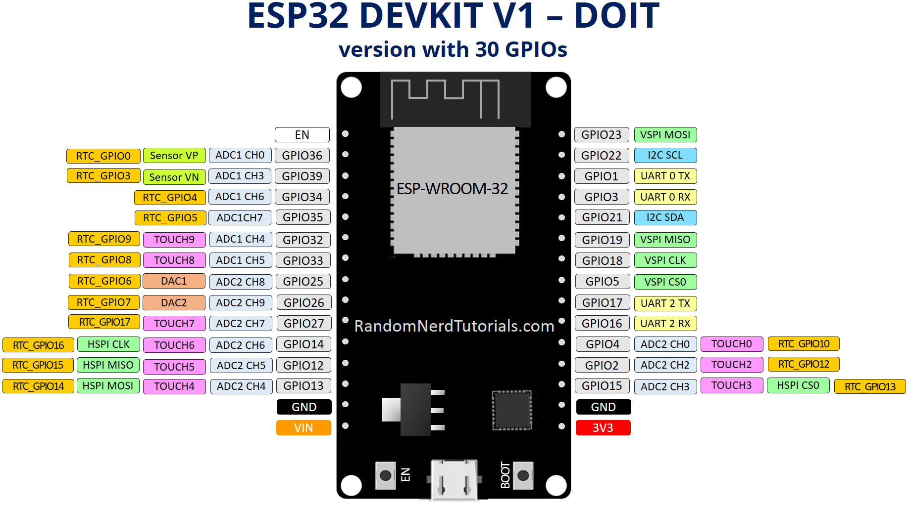

# ESP32
<b>My repository of ESP32's related projects</b> 
 
Pinout:  
                    
Arduino core for ESP32: https://github.com/espressif/arduino-esp32 
Video tutorials for ESP32 and MicroPython: https://www.youtube.com/playlist?list=PLKGiH5V9SS1hUz5Jh_35oTFM4wPZYA4sT 
Random Nerd Tutorials - ESP32 project examples: https://randomnerdtutorials.com/category/0-esp32/ 
